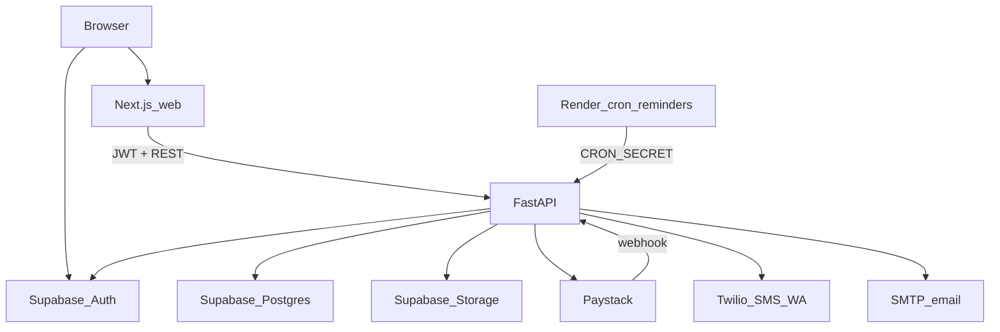

# Smart Prop — Architecture (as-built)

**Role:** Staff software architect  
**Compiled:** 2026-08-04  
**Scope:** Document the running system. Do not propose a greenfield rewrite.

---

## Summary

Smart Prop is a **two-app monorepo**:

| Layer | Location | Runtime |
|-------|----------|---------|
| API | Repo root (`main.py`, `routers/`, `lib/`) | FastAPI + Uvicorn |
| Web | `web/` | Next.js App Router |
| Data / Auth / Storage | Supabase | Postgres (RLS), Auth, Storage bucket `receipts` |

There is **no** NestJS, Redis, Sanity, or separate `api/` package.

---

## System diagram

---

## Repository layout

| Path | Role |
|------|------|
| [`main.py`](../main.py) | FastAPI app, CORS, health |
| [`routers/`](../routers/) | HTTP routers |
| [`lib/`](../lib/) | Auth, DB, Paystack, receipts, notify, reminder job |
| [`sql/`](../sql/) | Ordered Supabase migrations (`000`→`007+`) |
| [`web/`](../web/) | Next.js frontend |
| [`Dockerfile`](../Dockerfile) · [`render.yaml`](../render.yaml) | API + cron deploy |
| [`docs/`](./) | Product/research docs (this pipeline) |
| [`tests/`](../tests/) · [`.github/workflows/`](../.github/workflows/) | CI |

---

## Web (`web/`)

**Entry:** `web/app/layout.tsx`, `web/middleware.ts` → `web/lib/supabase/middleware.ts`.

| Area | Routes |
|------|--------|
| Marketing | `(marketing)/` → `/` |
| Dashboard | `(dashboard)/` → `/properties`, `/payments`, `/reminders`, `/settings`, nested property/unit routes |
| Auth | `/login`, `/signup`, `/auth/callback`, `/auth/signout`, `/auth/reset-password` |
| Onboarding | `/onboarding` |
| Admin | `(admin)/` → `/admin/leads` (email allowlist) |

**Public without session:** `/`, `/login`, `/signup`, `/auth/*`. Else require user.

**Notable libs:** `web/lib/auth-otp-channel.ts` (`NEXT_PUBLIC_AUTH_OTP_CHANNEL`), Supabase SSR clients under `web/lib/supabase/`.

---

## API (FastAPI)

**Entry:** [`main.py`](../main.py) — `GET /`, `GET /health`.

| Router | Prefix | Responsibilities |
|--------|--------|------------------|
| `routers/properties.py` | `/properties` | Properties CRUD; units create/get/patch/delete |
| `routers/payments.py` | `/payments` | Unit history; manual; Paystack pending/confirm; webhook |
| `routers/reminders.py` | `/reminders` | Unit log; send; bulk; retry; `POST /jobs/due` |
| `routers/users.py` | `/users` | `GET/PATCH /me` (profile + notification channel) |
| `routers/leads.py` | `/leads` | Admin leads |
| `routers/admin.py` | `/admin` | `GET /me` |

**Auth:** No separate auth router. `lib/auth.py` verifies Supabase JWT (`HTTPBearer`); data scoped in `lib/db.py`.

**Supporting:** `lib/paystack.py`, `lib/receipts.py`, `lib/notify.py`, `lib/reminder_job.py`, `lib/admin.py`.

---

## Data model (Postgres)

Core tables (from `sql/` baseline + follow-ons):

| Table | Purpose |
|-------|---------|
| `profiles` | Landlord profile; `notification_channel` |
| `properties` | Portfolio properties (+ optional coords) |
| `units` | Rent, due day, tenant contact fields |
| `transactions` | Payments; `receipt_url`, `payment_reference`; portfolio money-in via `GET /payments/` (paid, owner-scoped) |
| `reminders` | Outbound log / status / kind |
| `leads` | Marketing / admin pipeline |
| `admin_allowlist` | Admin gate |

RLS and hardening live in later `sql/002_*`… files. Apply in order via Supabase SQL Editor.

---

## Storage

- Bucket: **`receipts`** (public read of PDFs as currently configured).  
- Writer: `lib/receipts.py` via service role → `{transaction_id}.pdf`.  
- UI consumes `receipt_url` on the transaction row.

---

## Integrations

| System | Use |
|--------|-----|
| Supabase Auth | Phone OTP, email reset, sessions |
| Paystack | Online collect; webhook confirmation |
| Twilio | SMS and/or WhatsApp outbound |
| Mailgun (or SMTP) | Transactional email: landlord money-in, tenant due/receipt when channel=email (`lib/email_templates.py` + `lib/email_layout.py`; [`email-design-system.md`](email-design-system.md)) |
| Sentry | Optional API/web DSN |

---

## Config (high-signal)

**API (`.env.example`):** `SUPABASE_*`, `FRONTEND_URL` / `CORS_ORIGINS`, `CRON_SECRET`, Paystack, Twilio, Mailgun/`SMTP_*`, `ADMIN_EMAILS`, `SENTRY_DSN`.

**Web (`web/.env.example`):**

- `NEXT_PUBLIC_API_URL`  
- `NEXT_PUBLIC_SUPABASE_URL` / `ANON_KEY`  
- `NEXT_PUBLIC_PAYSTACK_PUBLIC_KEY`  
- `NEXT_PUBLIC_AUTH_OTP_CHANNEL` = `sms` \| `whatsapp`  
- `NEXT_PUBLIC_INVITE_ONLY_SIGNUP`  
- `ADMIN_EMAILS` (middleware)  

---

## Deployment

| Piece | How |
|-------|-----|
| API | Docker → Render web service `smart-prop-api` (`/health`) |
| Due reminders | Render cron → `python -m lib.reminder_job` (daily) calling secured job route |
| Web | Vercel or similar (README); no committed `vercel.json` required |
| CI | `.github/workflows/ci.yml` — API import/pytest; web lint; optional smoke |

---

## Security notes (v1)

- Landlord data access via Supabase JWT + server-side scoping / RLS.  
- Admin routes gated by allowlist emails.  
- Cron/job endpoints require `CRON_SECRET`.  
- Paystack webhook signature verification in payments router (keep hardened).  
- Service role key **never** exposed to the browser.  
- Invite-only signup reduces abuse during beta.

---

## Do not rebuild

From methodology docs ([`logo-exploration.md`](logo-exploration.md)) — **reject** as v1 architecture:

- NestJS + Redis + monorepo apps/packages rewrite  
- Sanity/Payload CMS, Storybook-first consulting site  
- Separate “AI client portal / proposal generator” platform  
- Glassmorphism design-system rewrite  
- Cloning Rentora’s tenancy/fee/inventory domain model  

Evolve the existing FastAPI + Next + Supabase shape; add tables/routes when the PRD’s Later items earn evidence.

---

## Evolution guidelines

1. New landlord feature → update [`PRD.md`](PRD.md) → SQL migration in `sql/` → router + web client.  
2. Reuse receipts Storage pattern for future documents.  
3. Keep notification send path centralized in `lib/notify.py`.  
4. Prefer fixing reliability (payments page, reminder retry) over new domains.

---

## Next artifact

→ [`product-prompt-playbook.md`](product-prompt-playbook.md) for role-based Cursor prompts against this stack.
