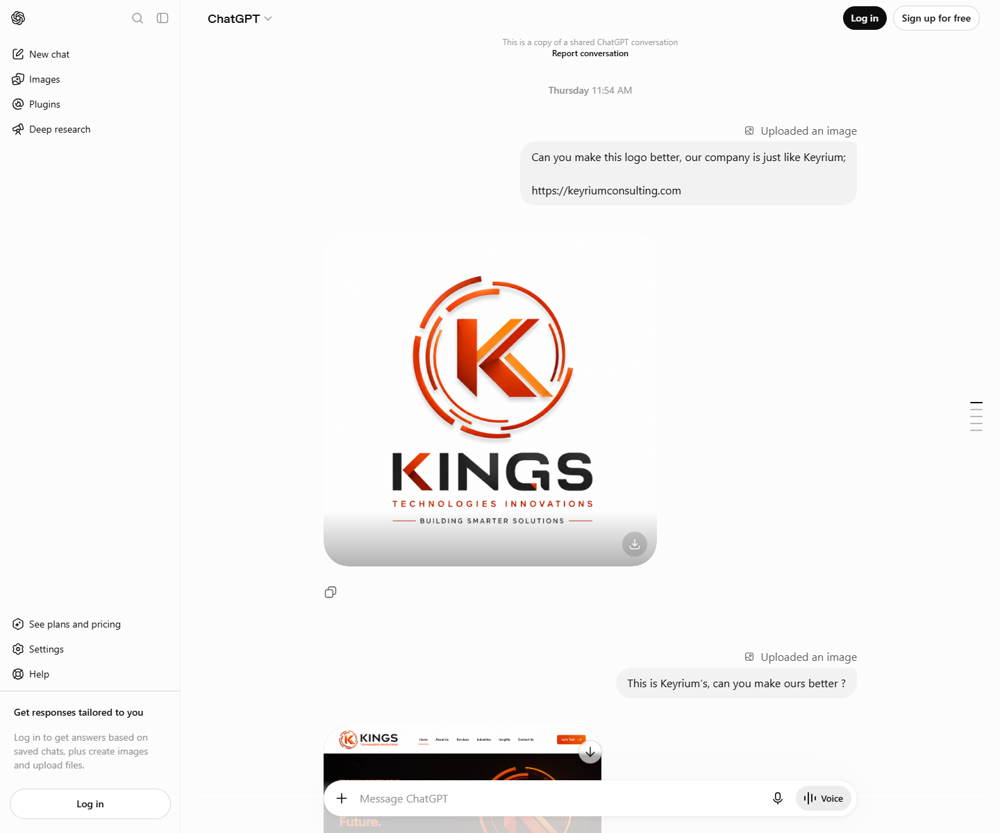
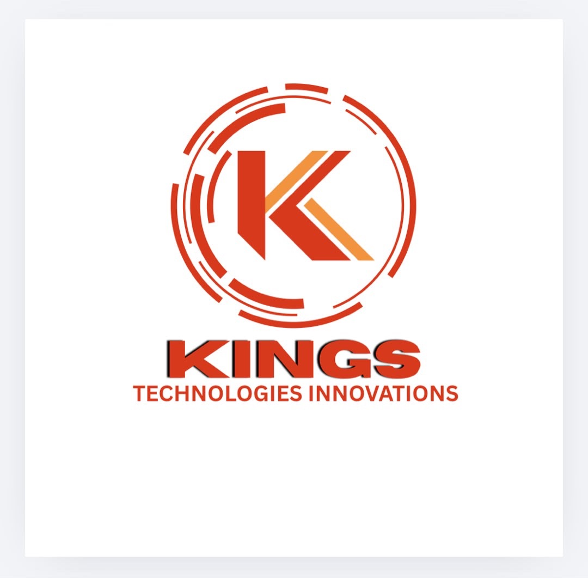
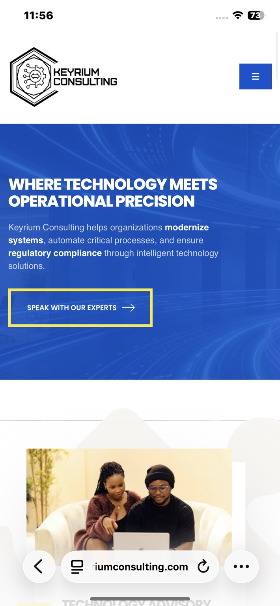
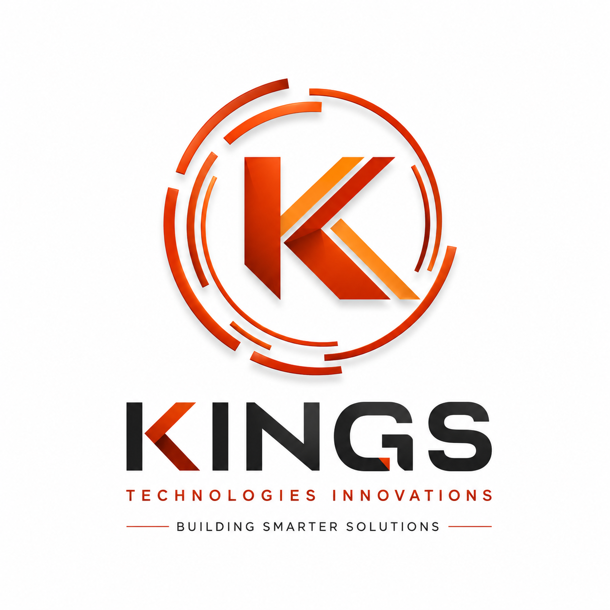
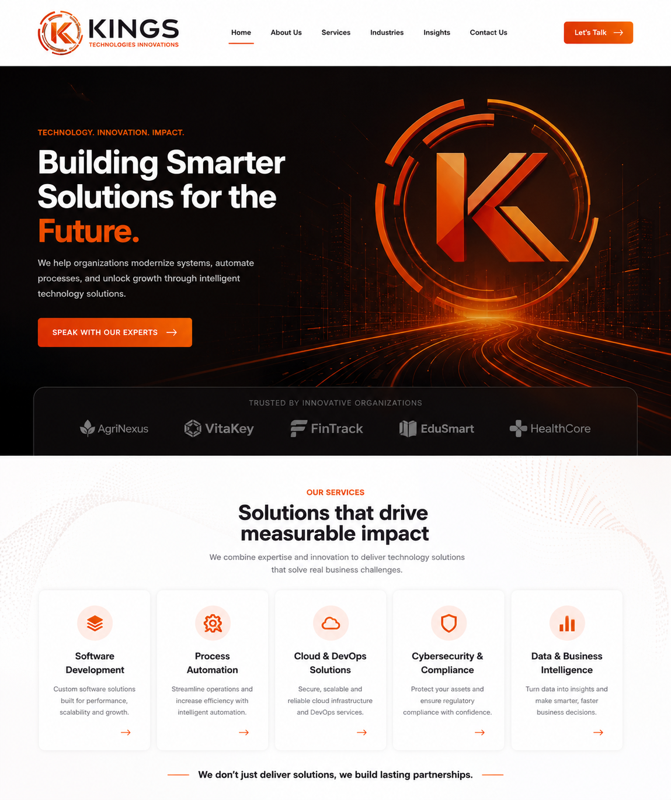
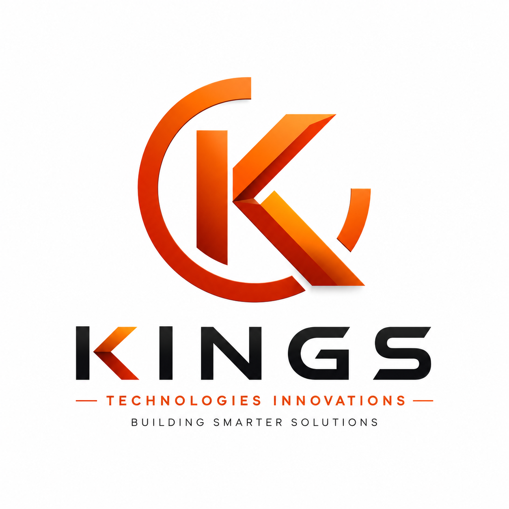

# Logo Design Enhancement — ChatGPT Share Archive

**Source:** https://chatgpt.com/share/6a720c6f-d440-83ea-83e3-1ed843a41d83
**Title:** Logo Design Enhancement
**Conversation ID:** `6a720c6f-d440-83ea-83e3-1ed843a41d83`
**Archived:** 2026-08-04

## Screenshot

Full-page capture of the shared conversation (after load + scroll so generated images rendered):



## Images index

| # | File | Role |
|---|------|------|
| 1 | [`01-…orbital-emblem.png`](./logo-exploration-images/01-generated-image-kings-tech-logo-with-orbital-emblem.png) | Generated logo variant A |
| 2 | [`02-…landing-page.png`](./logo-exploration-images/02-generated-image-corporate-tech-solutions-landing-page.png) | Generated landing-page mock |
| 3 | [`03-…technologies-logo.png`](./logo-exploration-images/03-generated-image-kings-technologies-logo.png) | Generated logo variant B |
| 4 | [`04-user-upload-kings-original.jpeg`](./logo-exploration-images/04-user-upload-kings-original.jpeg) | User upload — current KINGS logo |
| 5 | [`05-user-upload-keyrium-reference.jpeg`](./logo-exploration-images/05-user-upload-keyrium-reference.jpeg) | User upload — Keyrium site screenshot |
| — | [`chatgpt-share-full.png`](./logo-exploration-images/chatgpt-share-full.png) | Browser full-page screenshot |

### Image descriptions

#### 04 — User upload: original KINGS logo

- White background; warm orange/red palette.
- Circular emblem: stylized segmented capital **K** (stem + two diagonal arms), framed by dashed concentric orbital rings.
- Wordmark: bold orange **KINGS**; smaller orange **TECHNOLOGIES INNOVATIONS** underneath.
- Flat / light-3D corporate tech mark; no tagline in this upload.



#### 05 — User upload: Keyrium Consulting reference

- Mobile screenshot of keyriumconsulting.com.
- Logo: black hexagon + circuit/arrow mark with **KEYRIUM CONSULTING** wordmark.
- Hero: saturated blue field with light-trail graphics; white headline **WHERE TECHNOLOGY MEETS OPERATIONAL PRECISION**; ghost CTA **SPEAK WITH OUR EXPERTS** (yellow box drawn around it in the photo).
- Lower section shows two people on a sofa with a laptop.
- Palette: blue / white / black — contrast to KINGS orange.



#### 01 — Generated: KINGS Tech Logo with Orbital Emblem

- Off-white textured ground; richer 3D treatment than the upload.
- Ribbon/origami-style **K** in orange→deep red gradient, inside multi-layer broken orbital rings with soft drop shadow.
- Wordmark: mostly black **KINGS** with orange accent on the K; orange **TECHNOLOGIES INNOVATIONS**; black tagline **BUILDING SMARTER SOLUTIONS** between thin orange rules.
- Style: premium 3D corporate / futuristic.



#### 02 — Generated: Corporate Tech Solutions Landing Page

- Full marketing homepage mock for KINGS Technologies Innovations.
- Header: circular K mark + wordmark; nav; orange **Let's Talk** CTA.
- Dark hero with glowing 3D orange K over perspective light grid; kicker TECHNOLOGY. INNOVATION. IMPACT.; headline Building Smarter Solutions for the **Future.**; orange **SPEAK WITH OUR EXPERTS**.
- Trusted-by strip (AgriNexus, VitaKey, FinTrack, EduSmart, HealthCore).
- Light services grid with five orange-icon cards.
- Palette: black / white / vivid orange.



#### 03 — Generated: KINGS Technologies Logo

- Cleaner second logo pass on white.
- Thick open circular ring around a solid beveled 3D **K** (orange/gold gradient).
- Black **KINGS** (orange stem on K); orange **— TECHNOLOGIES INNOVATIONS —**; black tagline **BUILDING SMARTER SOLUTIONS**.
- Slightly simpler geometry than variant A; still glossy 3D.



## Full conversation

_Source text reconstructed from `GET /backend-api/share/{id}`. Image tool outputs are shown as assistant image generations._

### System note (share artifact)

> Original custom instructions no longer available

### Turn 1 — User

**Attached:** User upload — original KINGS logo


Can you make this logo better, our company is just like Keyrium;

https://keyriumconsulting.com

---

### Turn 2 — Assistant (image generation)

**Generated title:** KINGS Tech Logo with Orbital Emblem

**Image:** KINGS Tech Logo with Orbital Emblem


---

### Turn 3 — User

**Attached:** User upload — Keyrium Consulting mobile screenshot


This is Keyrium’s, can you make ours better ?

---

### Turn 4 — Assistant (image generation)

**Generated title:** Corporate Tech Solutions Landing Page

**Image:** Corporate Tech Solutions Landing Page


---

### Turn 5 — User

I request for a better logo so act like a senior and highly experienced designer and make it better

---

### Turn 6 — Assistant (image generation)

**Generated title:** KINGS Technologies Logo

**Image:** KINGS Technologies Logo


---

### Turn 7 — User

i wants to builds our official platfor, and since Keyrium replicate our ComPany we could use cursor agents to make it easier to implement without a product design or what do you think cursor can explore keyrium and it’s use case to build ours

---

### Turn 8 — Assistant

I think you can absolutely use **Cursor Agents** to accelerate development, but I would **not** tell Cursor to "replicate Keyrium." That creates unnecessary legal and ethical risk, and it will also limit your company's identity.

Instead, use Keyrium as a **market benchmark** and build something that is objectively better.

Here's the approach I'd take if I were the lead architect for Kings Technologies Innovations.

## Phase 1 — Research

Tell Cursor to perform competitive analysis, not copying.

Analyze companies like:

- Keyrium Consulting
- Accenture
- Deloitte Digital
- Thoughtworks
- Andela
- BairesDev
- Turing
- EPAM

The objective should be identifying:

- positioning
- messaging
- service offerings
- page hierarchy
- conversion funnels
- typography
- animations
- trust signals
- case study layouts
- navigation
- CTA placement

Then have Cursor summarize:

> "What do all successful technology consulting companies have in common?"

That becomes your blueprint.

---

# Phase 2

Then define **who Kings really is.**

From everything we've discussed over the past year, your company is much broader than Keyrium.

You're building a technology company focused on:

- AI Engineering
- Machine Learning
- Custom Software
- Cloud Infrastructure
- Backend Engineering
- Enterprise Applications
- Automation
- Digital Transformation
- Product Development
- Startup Consulting
- Government Solutions
- Agricultural Technology (Gardenia)
- Property Technology (VitaKey)
- Internal AI Platforms

That's already a stronger long-term vision.

---

# Phase 3

Have Cursor generate documentation before writing code.

For example:

```
You are a senior product strategist.

Research leading technology consulting companies.

Create a Product Requirements Document for Kings Technologies Innovations.

Do NOT copy any company's wording.

Instead, identify industry best practices and produce a premium consulting website capable of competing internationally.

Include:

- Information Architecture
- Sitemap
- User Personas
- Landing Pages
- CTA Strategy
- SEO
- Conversion Funnel
- Brand Voice
- Component Inventory
- Design System
```

---

# Phase 4

Only after the PRD exists should Cursor begin implementation.

Ask it to build:

```
Next.js 15
TypeScript
Tailwind CSS
shadcn/ui
Framer Motion
GSAP
MDX Blog
Sanity CMS
Supabase
Vercel
```

---

# Phase 5

Your website should feel more premium than Keyrium.

I wouldn't use a blue corporate theme.

Your logo already leans toward orange.

I'd evolve that into:

- Black
- White
- Orange
- subtle gradients
- glassmorphism
- premium motion
- futuristic illustrations

Think Apple meets Linear meets Stripe.

---

# Services

Rather than generic cards like Keyrium, I'd organize them around business outcomes:

**Engineering**

- Custom Software
- Enterprise Systems
- SaaS Development

**Artificial Intelligence**

- AI Agents
- Machine Learning
- LLM Integration
- RAG Systems

**Cloud**

- AWS
- Azure
- GCP
- Kubernetes

**Automation**

- Business Automation
- API Integration
- Workflow Engineering

**Cybersecurity**

- Security Reviews
- Compliance
- Secure Architecture

**Consulting**

- CTO-as-a-Service
- Architecture Reviews
- Digital Transformation

---

# Content

Avoid saying

> We build software.

Instead say things like

> Engineering intelligent systems that transform how organizations operate.

or

> We design AI-powered platforms that accelerate growth, automate operations, and create measurable business value.

That immediately positions you as a premium consulting firm.

---

## My biggest recommendation

I would actually build the entire platform **AI-first**, not just as a marketing website.

The website should include:

- Interactive AI assistant trained on your company
- Dynamic case studies
- Project estimator
- Discovery questionnaire
- Client portal
- Proposal generator
- Blog/CMS
- Careers portal
- Knowledge base
- Booking system
- Contact and lead management
- Admin dashboard
- Analytics dashboard

That turns the site into a business platform rather than a digital brochure.

Given your background in backend engineering and AI, this is a project that plays directly to your strengths. It also showcases your capabilities to potential clients, because the website itself becomes a demonstration of what Kings Technologies Innovations can build. memcite

---

### Turn 9 — User

Provide me steps and oprompt to make it happen

---

### Turn 10 — Assistant

If I were leading this project, I would treat Cursor as **my senior engineering team**, not just an autocomplete tool. The key is to have Cursor produce the strategy, architecture, design system, and implementation in phases. This prevents it from generating inconsistent code.

---

# MASTER PLAN

```
Phase 1
├── Company Research
├── Market Analysis
├── Competitive Analysis
├── Brand Positioning

Phase 2
├── Product Requirements Document
├── Design System
├── UX Strategy
├── User Flow

Phase 3
├── Information Architecture
├── Sitemap
├── Database Design
├── API Design

Phase 4
├── UI Components
├── Landing Pages
├── Dashboard
├── CMS

Phase 5
├── Backend
├── AI Features
├── Authentication
├── Deployment
```

---

# STEP 1 — Create a New Cursor Workspace

Create a new repository.

```
Kings-Technologies-Platform
```

Folder structure:

```
apps/
packages/
docs/
.cursor/
```

---

# STEP 2 — FIRST PROMPT (Research)

This is the very first prompt I would give Cursor.

```text
You are a team of world-class product strategists, UX researchers, software architects, branding consultants, AI engineers, and senior full-stack developers.

Your task is NOT to copy any company.

Instead, research leading technology consulting firms and identify industry best practices.

Research companies including:

- Keyrium Consulting
- Accenture
- Deloitte Digital
- Thoughtworks
- EPAM
- Turing
- BairesDev
- Andela

Create a complete research report covering:

• Company positioning
• Brand identity
• Navigation
• Services
• Homepage structure
• Conversion funnels
• Calls to Action
• Typography
• Color systems
• UI components
• Animation usage
• Client acquisition flow
• Trust signals
• Case studies
• Blog strategy
• SEO strategy
• Technology stack

Then recommend how Kings Technologies Innovations can differentiate itself instead of looking similar.

Do not generate any code yet.

Save everything inside

/docs/research.md
```

---

# STEP 3 — Product Strategy

```text
Based on the research report, write a complete Product Requirements Document (PRD) for Kings Technologies Innovations.

The company specializes in:

• Artificial Intelligence
• Machine Learning
• Enterprise Software
• Backend Engineering
• Cloud Infrastructure
• Automation
• Product Development
• Technology Consulting

The PRD should include:

Executive Summary

Business Goals

Mission

Vision

Core Values

Target Audience

Personas

Competitive Advantages

User Journeys

Information Architecture

Sitemap

Website Objectives

SEO Strategy

Lead Generation Strategy

Future Expansion

KPIs

Roadmap

Save inside

/docs/PRD.md
```

---

# STEP 4 — Brand Identity

```text
You are an award-winning creative director.

Design the complete visual identity for Kings Technologies Innovations.

Produce:

Brand personality

Typography

Spacing system

Grid

Iconography

Color Palette

Button system

Shadows

Cards

Illustrations

Animations

Glassmorphism rules

Accessibility

Dark Mode

Light Mode

Design Tokens

Save inside

/docs/design-system.md
```

---

# STEP 5 — UX Architecture

```text
Design a premium user experience for Kings Technologies Innovations.

Generate:

Homepage Wireframe

About

Services

Industries

Case Studies

Insights

Blog

Careers

Contact

Book Consultation

AI Assistant

Client Portal

Admin Dashboard

Include user flows.

Save as

/docs/wireframes.md
```

---

# STEP 6 — Technical Architecture

```text
You are a Staff Software Architect.

Design a scalable enterprise architecture.

Stack:

Next.js 15

TypeScript

TailwindCSS

Shadcn

Framer Motion

Supabase

PostgreSQL

Redis

Node.js

NestJS

Docker

GitHub Actions

AWS

Vercel

Produce:

Folder structure

Monorepo architecture

Database schema

Authentication

RBAC

API routes

Caching

Security

Deployment pipeline

Infrastructure

CI/CD

Save in

/docs/architecture.md
```

---

# STEP 7 — Database

```text
Design the complete PostgreSQL schema.

Include tables for:

Users

Roles

Permissions

Projects

Clients

Blog

Categories

Case Studies

Testimonials

Bookings

Newsletter

AI Conversations

Support Tickets

Invoices

Services

Industries

Media

Audit Logs

Notifications

Sessions

Use best practices.

Generate SQL migrations.
```

---

# STEP 8 — Landing Page

```text
Build a world-class homepage.

Requirements:

Luxury enterprise aesthetic

Apple-quality design

Stripe-quality UX

Linear animations

Responsive

SEO optimized

Accessible

Performance score above 95

Include:

Hero

Trusted By

Services

Why Us

Industries

Featured Projects

Testimonials

Blog

CTA

Footer

Use Framer Motion.

Use shadcn.

Use reusable components.

Do not use placeholder designs.
```

---

# STEP 9 — AI Features

```text
Design AI-powered features.

Include:

AI Business Consultant

Proposal Generator

Project Cost Estimator

Architecture Assistant

Document Search (RAG)

Meeting Summary

Knowledge Base

Client Chat

Ticket Assistant

Admin Copilot

Explain implementation architecture.
```

---

# STEP 10 — Client Portal

```text
Build a secure enterprise client portal.

Features:

Dashboard

Invoices

Projects

Tasks

Milestones

Messages

Contracts

File Uploads

Notifications

AI Assistant

Support

Dark Mode

Responsive
```

---

# STEP 11 — Admin Dashboard

```text
Build an enterprise admin system.

Modules:

Analytics

CRM

Projects

Clients

Invoices

Blog CMS

Media Library

Bookings

Newsletter

Users

Roles

Audit Logs

System Settings

Feature Flags

AI Analytics
```

---

# STEP 12 — Final Audit

```text
Perform a comprehensive audit of the entire codebase.

Evaluate:

Accessibility

SEO

Performance

Security

Scalability

Code Quality

Naming

Architecture

Animations

Consistency

Suggest improvements until the project reaches enterprise production quality.

Generate a report with action items.

Save to

/docs/audit.md
```

---

## Recommended Tech Stack

- **Frontend:** Next.js 15, TypeScript, Tailwind CSS, shadcn/ui, Framer Motion
- **Backend:** NestJS, PostgreSQL, Redis
- **Authentication:** Supabase Auth or Clerk
- **Database:** PostgreSQL (Supabase)
- **ORM:** Prisma
- **Storage:** Supabase Storage
- **Payments:** Stripe
- **Email:** Resend
- **CMS:** Sanity or Payload CMS
- **Deployment:** Vercel (frontend), Railway or AWS ECS (backend)
- **Monitoring:** Sentry, PostHog
- **Documentation:** MDX + Storybook

## One additional recommendation

Don't ask Cursor to do everything in one conversation. Create a `/docs` directory first and have it generate and refine each document (research, PRD, design system, architecture, etc.). Once those are reviewed and approved, switch Cursor into implementation mode. This document-first workflow produces a much more coherent platform than generating pages one at a time.

---

## Notes

- Captured with a headless Chromium session (Playwright). Initial paint hid images until scroll; final screenshot taken after scrolling the share page.
- Generated images downloaded from `oaiusercontent.com` CDN URLs embedded in the share view.
- User uploads downloaded via `/backend-anon/files/download/{file_id}?shared_conversation_id=...` → signed `download_url`.
- CDN URLs are signed and expire; local files under `docs/logo-exploration-images/` are the durable copies.
