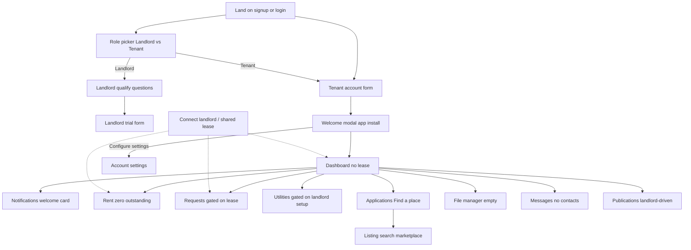

# TenantCloud — Tenant product audit (flows + principles)

**Date:** 2026-08-24  
**Sources:**
1. **Live browser** (gstack browse) — public auth/signup surfaces on `app.tenantcloud.com`  
2. **Authenticated screenshots** provided by user (tenant “Military Zeal / Mary Zeal”) — in-product empty states after signup  

**Access note:** Authenticated crawl completed 2026-08-24 on a live tenant session (`Emmanuel Okeowo`). Screenshots: `auth-*.png` under [`docs/tenantcloud-tenant-audit/screenshots/`](tenantcloud-tenant-audit/screenshots/). Earlier Mary Zeal shots remain useful as a **no-lease** empty-state reference; Emmanuel’s account shows a **lease-linked** notification path (utilities invite).

---

## 0. Authenticated session notes (Emmanuel)

**Global chrome on every page**
- Sidebar: Dashboard · Rent · Requests · Utility providers · Applications · File manager · Downloads · App (iOS/Android)
- Bell badge → `/feed`
- Site-wide banner: “Attention! Maintenance mode is on…”
- Intercom messenger FAB

**Home (`/`)**
- Profile: Emmanuel Okeowo + email
- Actionable notification card: **“Set up utilities — Your landlord has invited you to turn on your utilities for the Lease #”** → CTA **Set up utilities** → `/utility`
- Principle: landlord-originated task surfaces as a home card with a direct deep link (not only buried in feed)

**Nav map (confirmed live)**
| Label | URL |
|-------|-----|
| Dashboard | `/` |
| Rent | `/transactions` |
| Requests | `/maintenance` |
| Utility providers | `/utility` |
| Applications | `/applications` |
| File manager | `/file_manager` |
| Notifications | `/feed` |
| Messages chat / publications / MR | `/messages/chat`, `/messages/publications`, `/messages/maintenance_requests` |

**Login gate observed**
1. Email + password  
2. reCAPTCHA modal (automation-hostile)  
3. Email OTP (`/login/verify_email`) — 5 minute code  

Do not store credentials in repo; rotate if shared in chat.

---

## 1. End-to-end tenant flows

### F1 — Segment-first signup (live)
| Step | URL / UI | Notes |
|------|----------|--------|
| Role | `/signup/role` | Cards: **I’m a Landlord** (14-day trial) · **I’m a Tenant** (free). Preview rail: “LANDLORD PORTAL” / switches with role. **Next** disabled until role selected. |
| Tenant form | `/signup?role=tenant` | Google · Email · First/Last · Password (8+ / upper+lower+number) · SMS marketing opt-in · Terms. Preview: “TENANT PORTAL — Feel right at home in your rental.” CTA disabled until valid. |
| Landlord qualify | same `/signup/role` after landlord select | Persona radios · unit stepper · years managed · all required · then `/signup?role=admin&mode=1` with **phone required** + “Start my free trial”. |

### F2 — Sign-in (live)
`/login` — Google / Apple / Facebook · email+password · keep signed in 60 days · forgot password · reCAPTCHA disclosure.

### F3 — Post-signup welcome (screenshot)
Centered modal on `/?tab=outstanding`:
- Celebrate (“Welcome!”)
- Primary push: **mobile app** (Play / App Store + QR)
- Primary dismiss: **Done**
- Secondary: **Configure settings**
- Close (X)
- Behind modal: already shows **no-lease** dashboard (zero-state visible under overlay)

### F4 — Zero-lease dashboard (screenshot)
- Profile card (avatar initials, name, email)
- Hero empty: illustrated “what a lease looks like”
- Copy: landlord hasn’t shared lease → **contact landlord**
- Nav fully available even with no lease (browse-first, not wizard-locked)

### F5 — Notifications / feed (screenshot)
`/feed` — “Welcome to TenantCloud” unread card with CTAs:
- Let’s get started
- **connect your landlord/property manager**
- **pay online**
- Support modal  
Pattern: onboarding as **feed item**, not only modal.

### F6 — Rent / transactions (screenshot)
`/transactions` — Outstanding **$0.00** · filters · empty table “No transactions” (informational only; weak CTA).

### F7 — Maintenance requests (screenshot)
`/maintenance` — “No requests” + **prerequisite copy**: need landlord connection + shared lease. Same idea under Messages → MR channel.

### F8 — Utility providers (screenshot)
`/utility` — **Banner first**: “Currently not setup on Landlord side” + ask landlord · then empty list.

### F9 — Applications → find a place (screenshot)
`/applications` — empty + strong primary **Find a place** → marketplace/search (map + listing cards). Tenant can get value **without** a lease (marketplace as parallel path).

### F10 — Files (screenshot)
`/file_manager` — storage quotas at 0 · “No files” · weak empty CTA.

### F11 — Messages (screenshot)
`/messages/chat` — no contacts until connected users.  
`/messages/publications` — landlord-published posts; wait state.  
`/messages/maintenance_requests` — shared MR thread empty until lease/connection.

---

## 2. Information architecture (tenant shell)

**Primary sidebar (icon + labels when expanded):**  
Dashboard · Rent · Requests · Utility providers · Applications · File manager · Downloads · (App promo sticky)

**Chrome always present:** notifications bell (badge), Home, Messages, Help, account pill, avatar, support FAB, **App** download rail.

**Principle:** Full chrome + empty module pages > locking the app until lease exists.

---

## 3. Principles to follow (for Nexora)

| # | Principle | TenantCloud evidence | Nexora implication |
|---|-----------|----------------------|--------------------|
| P1 | **Segment before credentials** | Role cards → qualify (landlord) → auth | Keep role + landlord qualify; tenant form can be lighter |
| P2 | **Role-specific right rail** | Landlord vs Tenant portal preview | Keep heavy two-column; swap copy/mock by role |
| P3 | **Celebrate then convert** | Welcome modal → mobile app | Optional: WhatsApp/SMS “save this link” instead of native app if no app yet |
| P4 | **Useful zero state** | Illustrated lease preview + what to do next | Empty `/tenant`: show mock rent card + **Claim invite** as primary |
| P5 | **Name the blocker** | “Landlord hasn’t shared lease” / “not setup on Landlord side” | Never bare “No data”; say who must act |
| P6 | **Prerequisite, not dead end** | Maintenance explains lease requirement | Gate pay/docs with claim CTA, not blank tables |
| P7 | **Onboarding in the feed** | Welcome notification with link CTAs | One in-app “Getting started” card: claim · pay · docs |
| P8 | **Parallel value path** | Applications → Find a place without lease | Optional later; for v1 skip marketplace, keep claim as only unlock |
| P9 | **Module emptiness is honest** | Rent $0 / No transactions / No files | Match honesty; add one CTA where user can act |
| P10 | **Landlord-driven surfaces wait** | Publications / utilities | Docs & access wait on landlord invite — same pattern |
| P11 | **Settings always reachable** | Configure settings under Welcome | Tenant settings link from empty home |
| P12 | **Support always one tap** | FAB chat | Optional help / WhatsApp support for NG |

**Do not copy:** US marketplace/find-a-place as Phase 3 core; credit-bureau widgets; dense empty tables with no CTA; app-store QR if we have no mobile app.

---

## 4. Recommended Nexora tenant post-signup flow (aligned)

1. Signup as tenant → `/tenant`  
2. **Welcome sheet** (once): Claim invite + Done + settings / notices / copy home link / WhatsApp support  
3. Home zero state: rent preview + claim CTA + profile chip  
4. Nav: Home · Notices · Claim · Receipts · Docs · Requests · Utilities · Settings (+ Support FAB when configured)  
5. **Notices** feed seeded from tenancy state (welcome · connect · activate · pay · receipts · utilities · requests)  
6. After claim: collapse pending; show balance / pay when active  
7. **Requests / Utilities**: full chrome + honest empties (lease prerequisite or landlord-side wait) — no fake data  

### Implementation touch-base (2026-08-24)

| Principle | Status |
|-----------|--------|
| P1–P2 Signup segment + heavy rail | Shipped |
| P3 Welcome without app stores | Shipped (copy link / support) |
| P4–P6 Zero state + blocker + Claim | Shipped |
| P7 Notices feed | Shipped (`/tenant/notices`) |
| P8 Marketplace | Skipped (by design) |
| P9 Honest empties + CTA | Shipped (+ Requests / Utilities) |
| P10 Landlord-driven wait states | Shipped (claim / activate / utilities) |
| P11 Settings | Shipped (`/tenant/settings`) |
| P12 Support one-tap | Shipped (`NEXT_PUBLIC_SUPPORT_WHATSAPP`) |
| Landlord Payments invite + activate | Shipped |
| Home actionable deep-link cards | Shipped (claim / utilities / requests / access) |
| Tenant repair intake → landlord triage | Shipped |
| Landlord utility providers | Shipped (`unit_utility_providers`, Payments card) |
| Access passes / gate codes (F50) | Shipped (`/access`, `/tenant/access`) |
| Artisan invite / assign / complete (F51) | Shipped (`/work-orders`, `/artisan`, Payments assign) |
| IoT (F52) | Blocked (needs partner) |
| Marketplace artisans | Out of scope (invite-only) |

---

## 5. Live browser evidence log

| Capture | Result |
|---------|--------|
| `/login` | OK — social + email |
| `/signup/role` | OK — dual role + landlord qualify |
| `/signup?role=tenant` | OK — tenant form + portal rail |
| `/signup?role=admin&mode=1` | OK after qualify — trial form + phone |
| Cookie import Chrome | Failed DPAPI |
| Authenticated `/`, `/transactions`, etc. | OK (Emmanuel session 2026-08-24 / 2026-08-26) |

---

## 6. Tenant role deep-dive close-out (2026-08-26)

**Session:** Emmanuel Okeowo (`emmanuel@keyriumconsulting.com`) — still **no shared lease**; utilities invite card present on home.

### Account settings (finished)

| Tab | URL | Observed |
|-----|-----|----------|
| Profile | `/settings/account/profile` | Name/company/phone/avatar; email Unverified + Change/Verify; password Change; Additional: timezone/date/measurement/country (US defaults on this account) |
| My cards | `/settings/account/cards` | Empty: “No cards…”. **Actions → Add new card** (payment method vault for online rent / autopay) |
| Security | `/settings/account/security` | **Two-Step Authentication** (Enable + Learn more); **Login sessions** table (Location · Device · IP · Last activity · Current Session); MaxMind attribution |
| Notifications | `/settings/account/notifications` | Email / Feed / SMS columns × granular event toggles (already sampled earlier) |

### Messages hub (finished at empty states)

| Channel | URL | Empty copy |
|---------|-----|------------|
| Chat | `/messages/chat` | No contacts — “You can only send…” until connected users |
| Publications (`pb`) | `/messages/publications` | No posts — landlord hasn’t published |
| Maintenance (`mr`) | `/messages/maintenance_requests` | No shared requests |

Header always has Messages; rail does not.

### Applications → Find a place (finished)

- `/applications` — 0 Total + primary **Find a place**
- Opens `/applications/listings/search` with map + list
- Live sample: **~3929** US listings, search “Garden City, Kansas…”, filters Price / Rental type / Beds & Baths / More, sort New–Old, Mapbox clusters, promo badges, heart favorites
- **US marketplace** — parallel value path without a lease (P8). Not a Lagos Phase 3 core.

### Utilities invite path (confirmed)

- Home card: landlord invited utilities setup → CTA → `/utility`
- Page still shows “Currently not setup on Landlord side” + empty list
- Principle: landlord-originated task can surface **before** lease share is complete

### Explicitly still blocked on this tenant account

Needs a **lease-linked** tenant (or Mary Zeal with lease) — out of scope for closing *this* no-lease role pass:

- Pay rent / autopay / invoice detail  
- E-sign lease / insurance upload  
- Rent reporting (US-only anyway)  
- Maintenance submit with photo/video  
- Connected chat + real publications  

### Tenant role status

**Pre-lease tenant portal audit: COMPLETE (2026-08-26).**

### Pragmatic gap close (Nexora)

| TC finding | Nexora disposition |
|------------|-------------------|
| Account tabs Profile / Security / Notifications | **Shipped** (tenant + landlord) |
| Email verified badge + Verify | **Shipped** |
| Preferred channel + mismatch when no phone/email | **Shipped** |
| Locale timezone / date format (NG defaults) | **Shipped** (`Africa/Lagos`, `dd/mm/yyyy`) |
| Messages in header | **Closed** — rail badge (aligned landlord/tenant) |
| Honest empties + name the blocker | **Shipped** (tenant home / requests / utilities) |
| Landlord-originated home task card (e.g. utilities) | **Shipped** pattern via notices / getting-started |
| Maintenance photo attach (file upload, not URL paste) | **Shipped** (`POST /maintenance/me/photo` + tenant/landlord thumbs) |
| My cards / Paystack authorization vault | **Shipped** (Settings → Cards; ₦100 verify charge) |
| 2FA + login sessions | **Shipped** (TOTP enroll + sign out other sessions; email login challenge) |
| Full Email×SMS×WhatsApp×In-app event matrix | **Shipped** (Notifications tab; rent_due / receipt respect prefs) |
| Find a place / US marketplace | **Skip** for NG core (P8) |
| Lease-linked TC pay / e-sign / rent reporting audit | **Park** — needs lease-linked TC account; rent reporting US-only |
| Video on maintenance requests | **Defer** — photo only for v1 |
| Autopay recurring charges | **Shipped** (saved card + due-day cron via `/reminders/jobs/due`; Home enable + pay-with-card) |

**Optional later (not blocking landlord audit):** one lease-linked tenant session for pay + e-sign media only.

---

## 7. Handoff to next role

Next: **Landlord / PM portal** — follow [`tenantcloud-landlord-audit.md`](tenantcloud-landlord-audit.md) procedure.  
After that (only if needed): Owner portal → Service Pro portal.  
